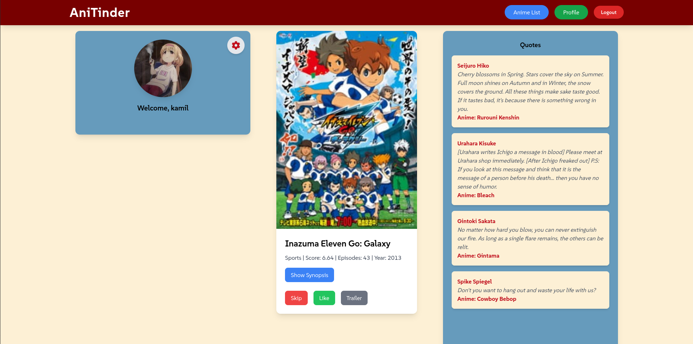
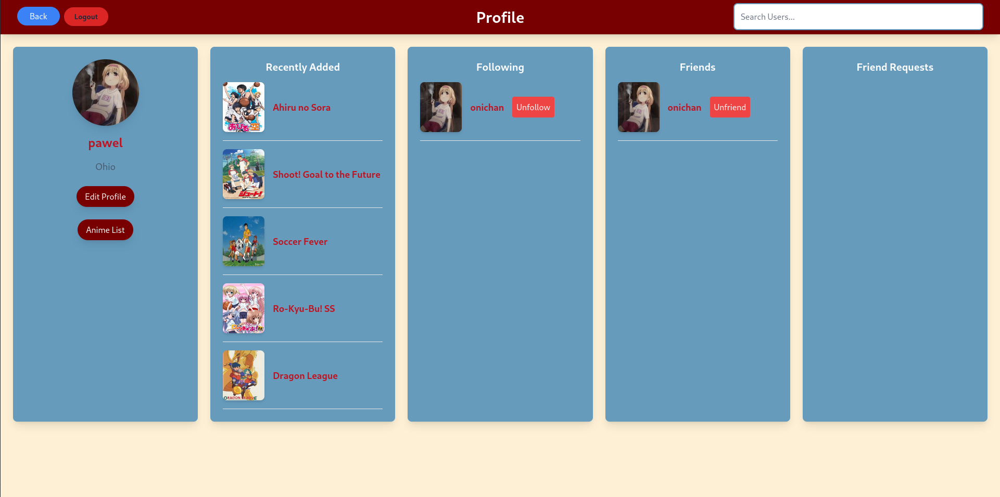
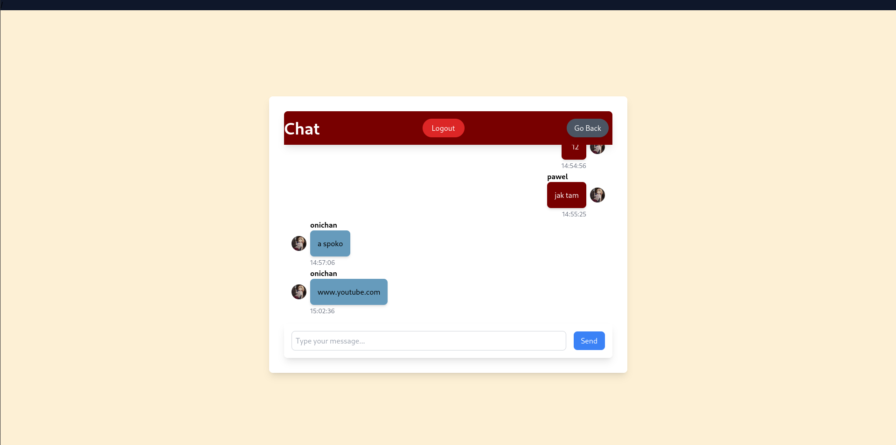

# AniTinder

AniTinder is a web application similar to Tinder but designed for anime recommendations. Users can register, log in, chat with friends, and look into their own and other users' anime lists.

## Features

- User Registration and Login
- Chat with Friends
- View and Manage Personal Anime List
- View Other Users' Anime Lists
- Anime Recommendations

## Technologies Used

### Backend

- **Django**: A high-level Python web framework that encourages rapid development and clean, pragmatic design.
- **SQLite3**: A C-language library that implements a small, fast, self-contained, high-reliability, full-featured, SQL database engine.

### Frontend

- **React**: A JavaScript library for building user interfaces.
- **React Router**: A collection of navigational components that compose declaratively with your application.

## Overview
### Home Page and Profile Page
<p float="left">
  
  
</p>

### Anime List Page and Chat Page
<p float="left">
  
  
</p>


## Installation

### Backend

1. Clone the repository:
    ```bash
    git clone git clone https://github.com/yourusername/AniTinder.git
    cd AniTinder/backend
    ```

2. Create a virtual environment and activate it:
    ```bash
    python -m venv venv
    source venv/bin/activate  # On Windows use `venv\Scripts\activate`
    ```

3. Install the required packages:
    ```bash
    pip install -r requirements.txt
    ```

4. Apply migrations and start the server:
    ```bash
    python manage.py migrate
    python manage.py runserver
    ```

### Frontend

1. Navigate to the frontend directory:
    ```bash
    cd ../frontend
    ```

2. Install the required packages:
    ```bash
    npm install
    ```

3. Start the development server:
    ```bash
    npm start
    ```

## Usage

1. Open your browser and navigate to `http://localhost:3000` to access the frontend.
2. Register a new account or log in with an existing account.
3. Explore anime recommendations, chat with friends, and manage your anime list.

## Overview

AniTinder uses AWS S3 to store user profile pictures (PFP). This allows for scalable and reliable storage of user images.

## AWS S3 Integration

To enable AWS S3 storage for user profile pictures, follow these steps:

1. Install the required packages if you haven't already:
    ```bash
    pip install boto3 django-storages
    ```

2. Update your Django settings (`settings.py`) to configure AWS S3:
    ```python
    # settings.py

    INSTALLED_APPS = [
        ...
        'storages',
    ]

    AWS_ACCESS_KEY_ID = 'your-access-key-id'
    AWS_SECRET_ACCESS_KEY = 'your-secret-access-key'
    AWS_STORAGE_BUCKET_NAME = 'your-bucket-name'
    AWS_S3_REGION_NAME = 'your-region'  # e.g., 'us-west-2'
    AWS_S3_CUSTOM_DOMAIN = f'{AWS_STORAGE_BUCKET_NAME}.s3.amazonaws.com'

    DEFAULT_FILE_STORAGE = 'storages.backends.s3boto3.S3Boto3Storage'
    ```

3. Ensure your AWS credentials are properly configured and the S3 bucket is set up with the correct permissions.

By following these steps, user profile pictures will be stored in AWS S3, providing a scalable solution for image storage.

## License

This project is licensed under the MIT License. See the `LICENSE` file for more details.
